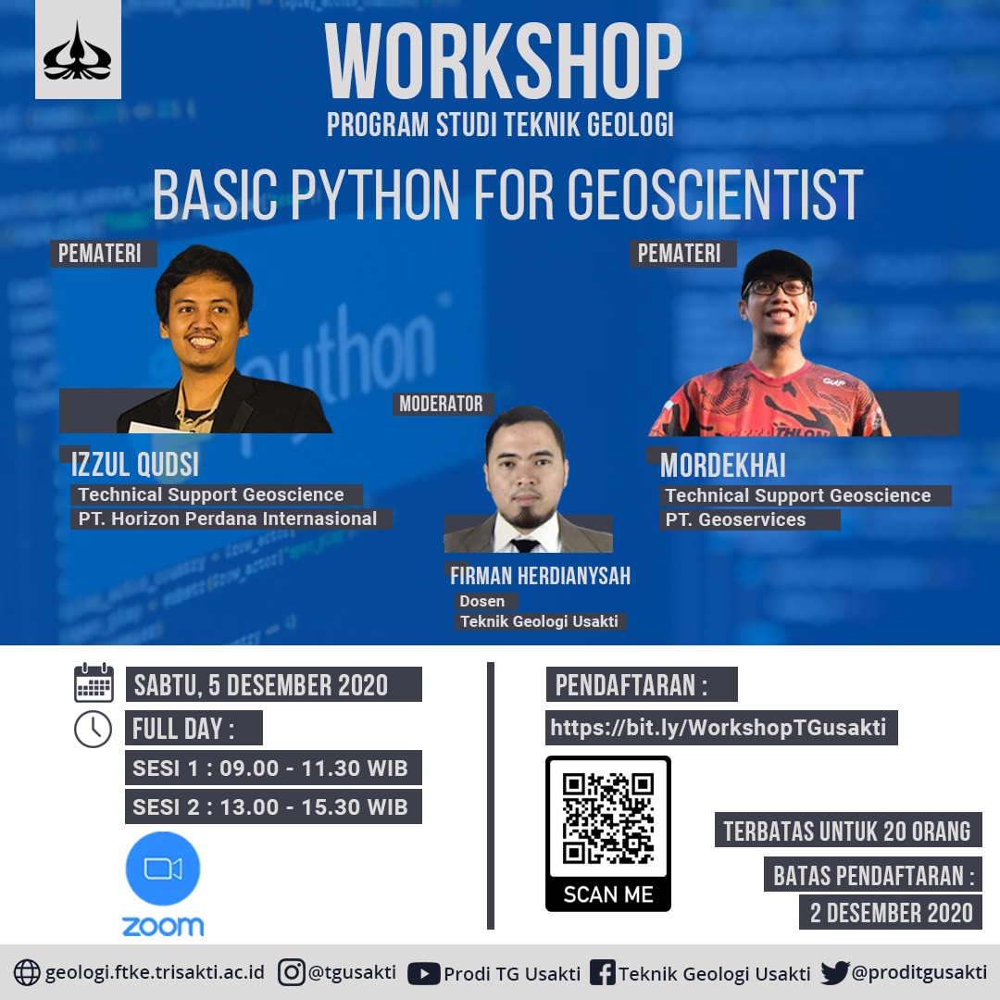

# Basic Python for Geoscientist Workshop
## Repository for One-day Workshop at Program Studi Teknik Geologi Universitas Trisakti (Second Session)

### This session covers the following subjects:
- Matplotlib
- Classification (Facies Prediction using well log data)
- Regression (Vp Prediction using well log data)

Please check the **jupyter-notebook folder** to get the .ipynb file.

Notes: The well data files used in the notebook are already given at the workshop

Link for the First Session Workshop repository:
https://github.com/panjoel4/Basic-Python-Workshop

